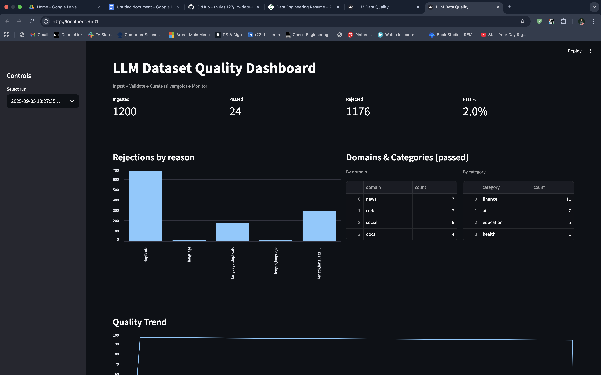
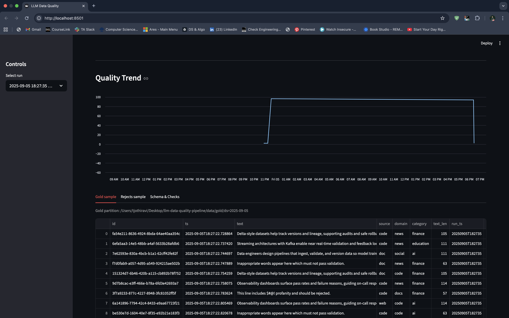

# LLM Dataset Quality Pipeline

An end-to-end, production-styled path from **raw text** to **curated, versioned datasets** with **live quality telemetry**. Built to demonstrate how we can keep “garbage out” before it becomes “garbage in” for ML/LLM training.

---

## Why this matters (short story)
Most web text isn’t training‑ready. It’s full of duplicates, non‑English content, profanity, or fragments that say nothing. 
If we feed that to a model, we teach it the wrong lessons. This project shows how to **ingest**, **check**, and **curate** data 
so what reaches your models is defensible and easy to trace.

---

## 2) Scope
### In scope (MVP)
- **Streaming ingest** via Kafka (Redpanda)
- **Deterministic quality gates**: length, language≈English, profanity list, within-batch de-dup
- **Medallion storage** in Parquet: **Bronze** (raw), **Silver** (clean), **Gold** (curated/day-partitioned)
- **Run manifest (JSON)**: counts, rejection breakdown, artifact paths
- **Dashboard** (Streamlit + DuckDB): KPIs, reasons, trends, samples
- **Orchestration** with Prefect (single node)

> Terminology made plain:  
> – *Checks* = data quality checks (sometimes called “quality gates”).  
> – *Run log* = a small JSONL file that summarizes each run (counts, reasons, file paths).

---

## How it works (at a glance)
```
Data Source → Kafka (Redpanda) → Prefect Flow
           → Checks (length / language / profanity / duplicate)
           → Bronze (raw) + Silver (clean)
           → Gold (ready for training, by day)
           → Streamlit Dashboard (metrics + samples)
```

**Per run**
1) A producer sends JSON messages to Kafka topic `raw_text`.  
2) The Prefect flow reads a batch (e.g., ~1,000 messages or ~30 seconds).  
3) Each record passes or fails the checks.  
4) We write **Bronze** (raw), **Silver** (passed), **Rejected** (failed with reason), and **Gold** (curated by day).  
5) We append one line to the **run log** so you can trace what happened.

---

## Data shape (after cleaning)
- `id` (UUID), `ts` (UTC time), `text` (string), `text_len` (derived)  
- `source` (`web|doc|code`), `domain` (`news|code|social|docs`), `category` (`ai|finance|health|education`)

**Checks used in the MVP**
- **Length**: 20 ≤ `text_len` ≤ 4,000  
- **Language**: text looks like English (heuristic)  
- **Profanity**: rule‑based deny list  
- **Duplicate**: drop duplicates within the current batch (by `(source, text)`).

---

## Output folders
```
data/
  bronze/run_ts=YYYYMMDDTHHMMSS/raw.parquet
  silver/run_ts=YYYYMMDDTHHMMSS/good.parquet
  rejects/run_ts=YYYYMMDDTHHMMSS/bad.parquet
  gold/ds=YYYY-MM-DD/gold.parquet
manifests/versions.jsonl    # the run log: one JSON line per run (counts, reasons, paths)
```

---

## Runbook (how to run it)

### Prerequisites
- **Docker Desktop** (for Redpanda/Kafka)
- **Python 3.9+**

### Quickstart (synthetic data)
```bash
# 0) Clone & enter
cd llm-data-quality-pipeline

# 1) Start Redpanda (Kafka API)
docker compose up -d

# 2) Python env
python3 -m venv .venv
source .venv/bin/activate
python -m pip install --upgrade pip
python -m pip install -r requirements.txt

# 3) Produce synthetic messages
python producers/kafka_text_producer.py

# 4) Run one pipeline batch
python prefect_flows/pipeline.py

# 5) Open the dashboard
python -m streamlit run streamlit_app/app.py
# visit http://localhost:8501
```

### Use a real dataset (Hugging Face → Kafka)
```bash
python -m pip install datasets

# Example (v3-compatible)
HF_DATASET=wikipedia HF_CONFIG=20220301.en HF_SPLIT=train LIMIT=2000   python producers/hf_kafka_producer.py

# Another example
HF_DATASET=ag_news HF_SPLIT=train LIMIT=2000   python producers/hf_kafka_producer.py

# Then run pipeline + dashboard
python prefect_flows/pipeline.py
python -m streamlit run streamlit_app/app.py
```

**Producer env vars**: `HF_DATASET`, `HF_CONFIG` (if needed), `HF_SPLIT`, `LIMIT`, `THROTTLE_MS`, 
`KAFKA_BOOTSTRAP` (default `localhost:9092`), `KAFKA_TOPIC` (default `raw_text`).  
*Note: some older, script‑based datasets (e.g., `openwebtext`) aren’t supported in `datasets` v3. Use v3‑compatible sets or pin `datasets<3.0`.*

---

## Dashboard preview



---

## Troubleshooting (fast answers)
- **`docker: command not found`** → start Docker Desktop; on macOS add:  
  `export PATH=$PATH:/Applications/Docker.app/Contents/Resources/bin`
- **Kafka not ready** → wait a few seconds; `docker compose logs -f`
- **Moved folder → “bad interpreter”** → rebuild venv:
  ```bash
  deactivate 2>/dev/null || true
  rm -rf .venv
  python3 -m venv .venv
  source .venv/bin/activate
  python -m pip install -r requirements.txt
  ```
- **HF error “Dataset scripts no longer supported”** → use v3‑compatible datasets or `python -m pip install "datasets<3.0"`
- **Port 9092 busy** → stop other Kafka or change port in `docker-compose.yml` and set `KAFKA_BOOTSTRAP` accordingly

---

## Next steps (nice to have)
- Deduplicate across runs using content hashes
- Add PII/advanced toxicity checks
- “Download latest Gold” from the UI; log dataset lineage (e.g., MLflow)
- Spark/Airflow variants for scale‑out

---

## Git hygiene
```
# .gitignore (recommended)
.venv/
__pycache__/
*.pyc
data/
manifests/
.streamlit/
```
To keep folder structure without data:
```
data/*
!data/.keep
manifests/*
!manifests/.keep
```
